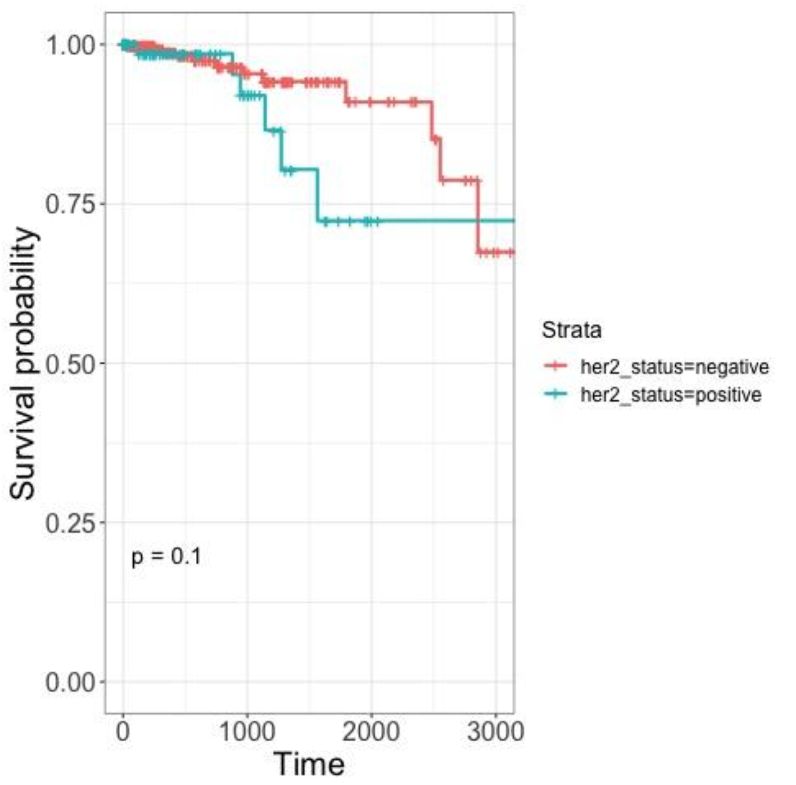
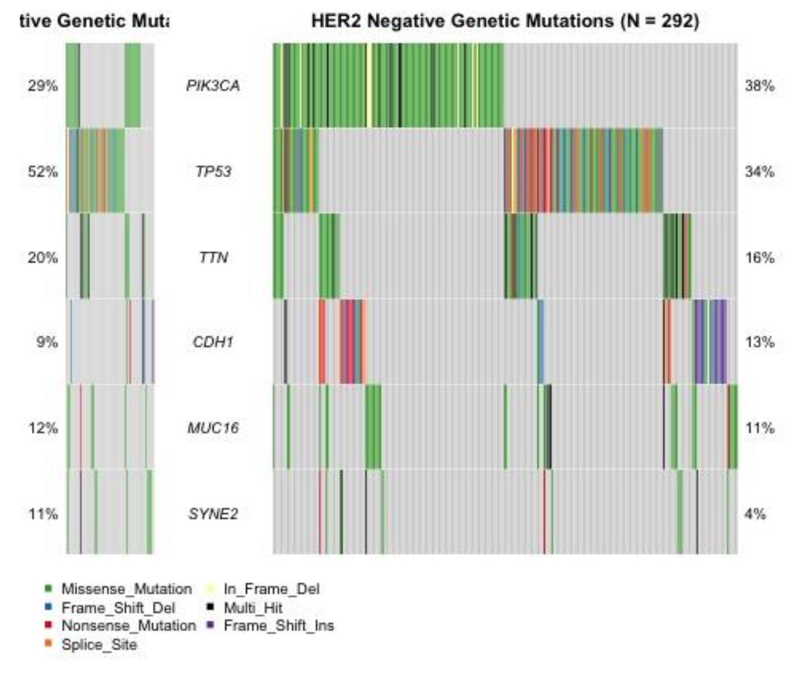
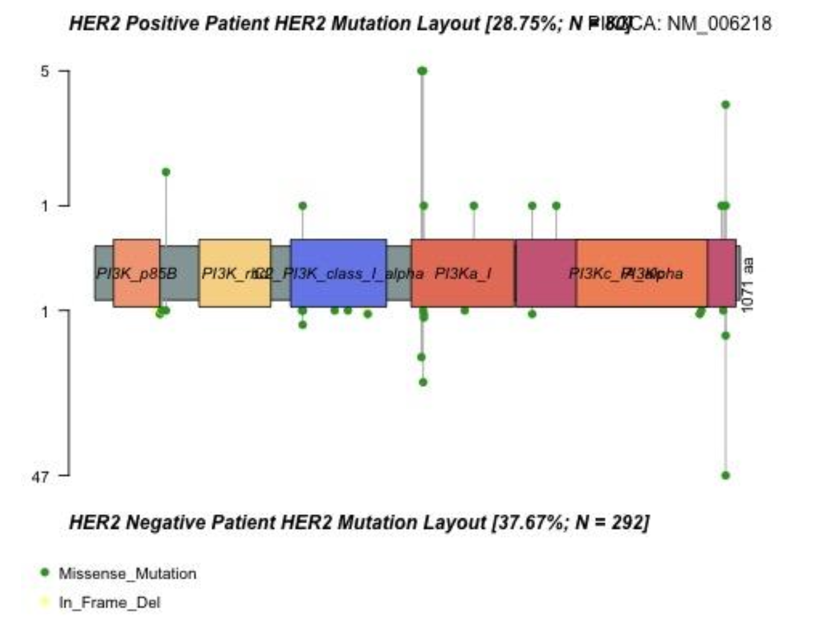
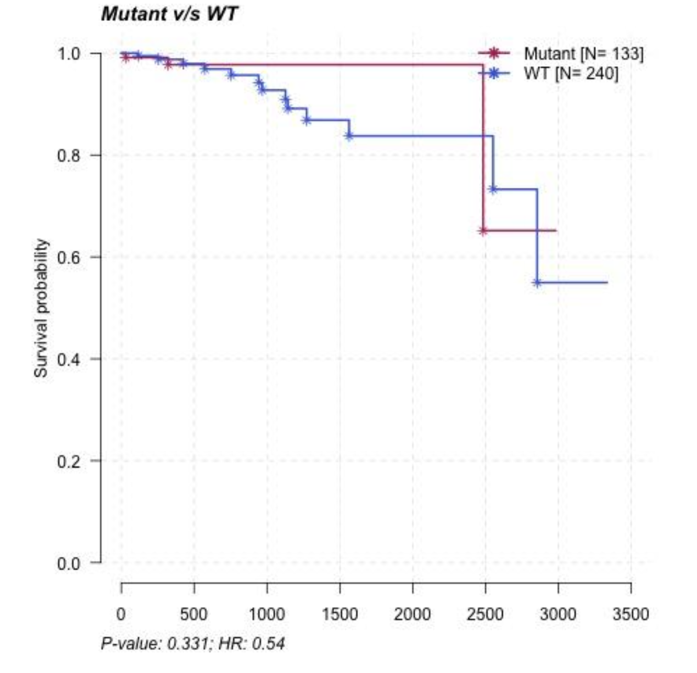
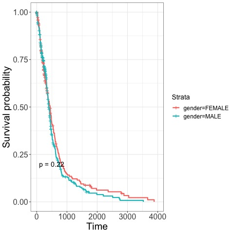
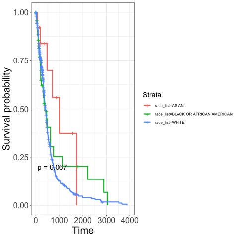
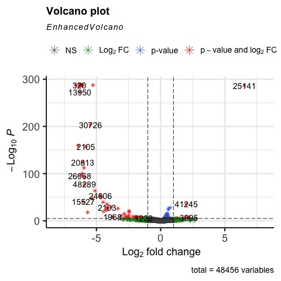

# TCGA Cancer Genomics Analysis
**QBIO 490 | USC**
*Presented at the Ellison Institute, 2022*

## Overview
This repository contains two computational biology projects analyzing cancer genomics data from The Cancer Genome Atlas (TCGA) using R and Python. Both projects take a multi-omic approach, integrating genomic, transcriptomic, and proteomic data to investigate cancer biology.

---

## Project 1: PIK3CA Mutations in Breast Cancer (Midterm)
**Dataset:** TCGA-BRCA
**Question:** Are PIK3CA mutations more common in HER2+ or HER2- patients, and how does this affect survival?

**Approach:**
Clinical data was accessed from TCGA-BRCA. HER2 status was determined using immunohistochemistry results, classifying patients as HER2+ (3+) or HER2- (0 or 1+), with borderline (2+) and NA values excluded. Kaplan-Meier survival plots were generated using patient vital status and follow-up time. MAF mutation data was used to generate co-oncoplots, a co-lollipop plot, and a MAF survival curve, all stratified by HER2 status. PIK3CA was selected for focused analysis based on its high mutation frequency in HER2- patients.

**Figures:**


*Figure 1. Kaplan-Meier survival plot shows that HER2- patients have an overall higher survival rate than HER2+ patients.*


*Figure 2. Oncoplots show that HER2- patients have the most PIK3CA mutations, while HER2+ patients have the most TP53 mutations.*


*Figure 3. Lollipop plot shows that most mutations were missense mutations, and song HER2- and HER2+ patients, the mutations fell in the same place.*


*Figure 4. MAF survival plot attempts to show that mutated PIK3CA patients have a higher survival rate than the wild-type patients. Mutated N=133, WT N=240.*

**Key Findings:**
- HER2- patients showed higher PIK3CA mutation rates (38%) vs HER2+ (29%)
- PIK3CA mutations in both groups occured predominantly as missense mutations inthe same protein domains
- HER2- patients had higher overall survival rates than HER2+ patients (p= 0.1)

**Limitations:**
The MAF survival analysis comparing PIK3CA mutant vs. wild-type patients had a relatively small mutant sample (N=133), limiting the statistical power of the survival conclusion (p=0.331). Additionally, the borderling HER2 patients (2+) were excluded entirely, which reduces sample size and may not reflect real clinical populations where borderling cases are common.

**Tools:** R, ggplot2, maftools, survminer, TCGAbiolinks

---

##Project 2: Survivor vs Non-Survivor Genomic Profiles in GBM (Final)
**Dataset:** TCGA-GBM
**Question:** What genomic and transcriptomic differences distinguish GBM survivors from non-survivors?

**Approach:**
Clinical data was accessed from TCGA-GBM. Kaplan-Meier survival plots were generated for sex and race after removing patients with NA values for each variable. A DESeq2 analysis was run on GBM pateints sorted by survivor status, integrating clinical, genetic, and transcriptomic data. 

**Figures:**


*Figure 1. Kaplan-Meier survival plot suggests that survival rate does not differ with sex.*


*Figure 2. Kaplan-Meier survival plot suggests that white patients have the lowest survival rate, followed by black or African-American patients, and finally Asian patients.*


*Figure 3. Enhanced Volcano plot suggests that between male and females, there are statistically significant, down-regulated genes. Volcano plot differing by sex. Red markers demonstrate statistically significant differences in regulation.* 


*Figure 4. Kaplan-Meier survival plot suggests that survival rate does differ with age.*

**Key Findings:**
- PAX1 was the most upregulated gene in survivors; AC009315.1 most upregulated in non-survivors
- LINC00645, a non-coding RNA, was identified as a potential biomarker consistent with prior GBM literature
- Most differentiall expressed genes transcribe to non-coding RNAs
- Older patients showed lowest survival rates; no significant sex-based difference 

**Limitations:**
The survivor/non-survivor classification used in this analysis define "survivors" as patients with living vital status at time of data collection, rather than survival past a defined time threshold (e.g., 12 or 24 months post-diagnosis). This conflation of "currently alive" with "long-term survivor" is a meaningful methodological limitation that affects the interpretation of the DESeq2 analysis. A more rigorous follow-up analysis would define survival using a fixed time cutoff. 

**Tools:** R, Python, DESeq2, maftools, survminer, TCGAbiolinks, pandas, matplotlib, numpy

---

## Repository Structure
\'''
├── midterm-breast-cancer/     # Breast cancer PIK3CA analysis
│   ├── midterm_joshuagabbay.R
│   ├── midterm_lab_report.pdf
│   └── figures/
└── final-brain-cancer/        # GBM survivor analysis
    ├── Final.R
    ├── methods.docx
    └── figures/
\```

## About
Projects completed as part of QBIO 490 - Student-Led Research Group.
Data sourced from the NIH Cancer Genome Atlas (TCGA).
